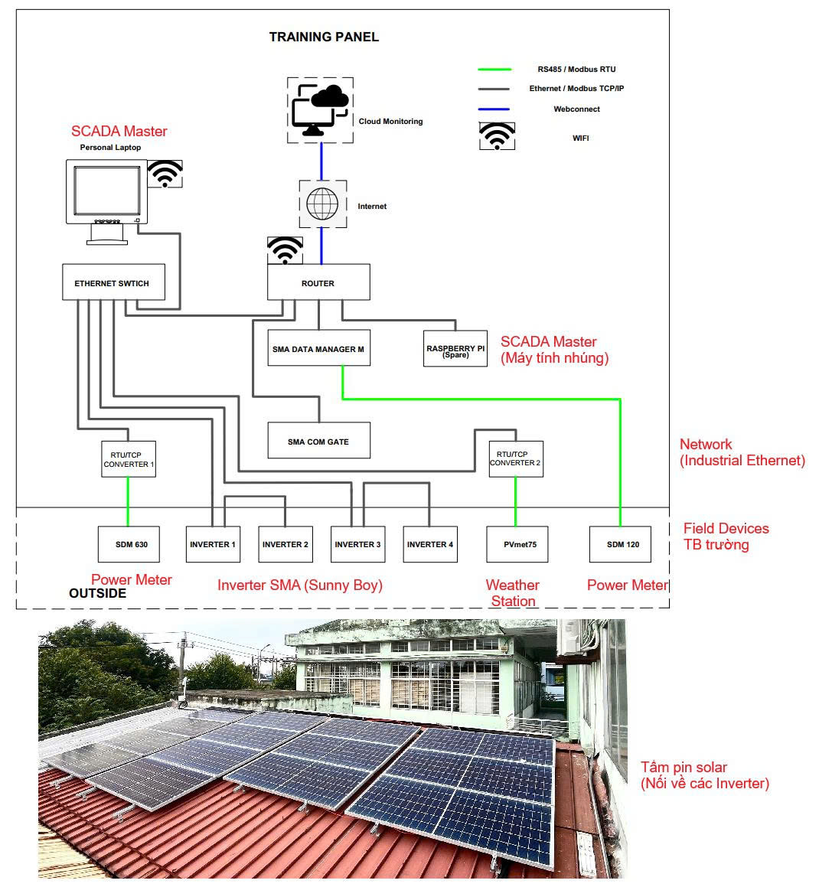
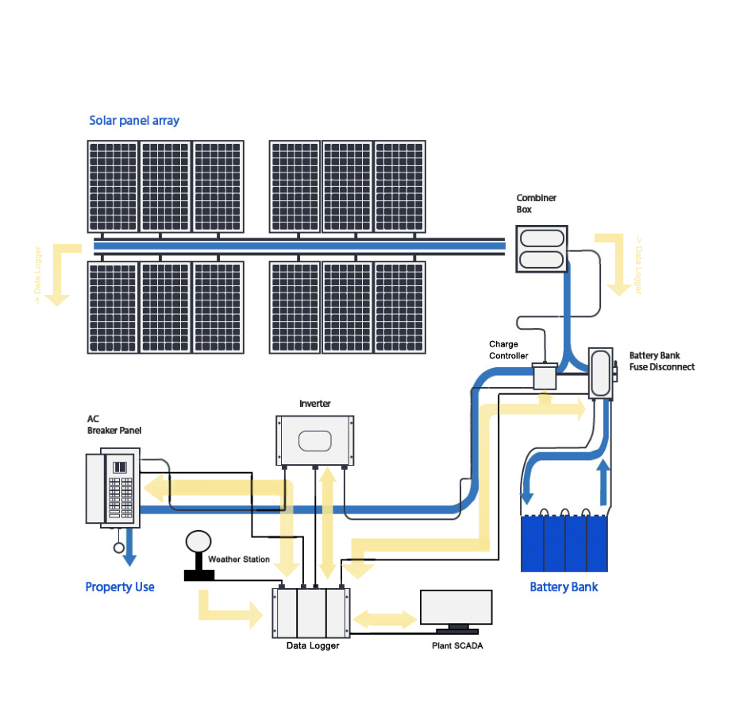

# SCADA System for Solar Power Generationusing Raspberry Pi 3

## Introduction
The **SCADA Solar Rooftop System** project aims to build a **smart monitoring and control system** for rooftop solar power using SCADA technology.  
It integrates hardware (PV, Inverter, Battery, Data Logger, Raspberry Pi) and software (SCADA/HMI, Cloud) to **monitor, control, and optimize solar energy operations**.

✨ **Key Benefits**:
- Reduce electricity costs.
- Utilize clean & renewable energy.
- Real-time monitoring and predictive maintenance.
- Increase energy independence for households and businesses.

---

## System Architecture

The system is divided into 3 SCADA levels:

1. **Field Level**  
   - PV Array (solar panels)  
   - Combiner Box, Fuse, AC Breaker  
   - Battery Bank (energy storage)  
   - Weather Station (measures irradiance, temperature, wind, humidity)  
   - Inverter (DC → AC conversion)  
   - Charge Controller  

2. **Control Level**  
   - Inverter (PWM, MPPT control, voltage/current monitoring, SCADA communication)  
   - Charge Controller (controls charging process)  
   - Data Logger (can trigger safety cut-offs)  

3. **Supervisory Level**  
   - Plant SCADA (Server + HMI)  
   - Raspberry Pi & Data Logger (data acquisition and transmission)  
   - Dashboard (real-time monitoring, alarms, performance analysis)  

---

## Workflow

1. **Solar Energy Conversion**  
   PV array → generates DC power.  

2. **DC → AC Conversion**  
   Sunny Boy inverters convert DC → AC 220/380V, synchronized with the grid.  

3. **Grid Connection & Power Supply**  
   AC power is supplied to local loads, excess power → exported to the grid.  

4. **Measurement & Data Collection**  
   - SDM630, SDM120: measures power, voltage, current.  
   - PVmet75: irradiance, temperature, wind speed.  
   - Data transmitted via RS485 → Modbus TCP.  

5. **Data Management & Monitoring**  
   - SMA Data Manager M + Router + Switch aggregate data.  
   - SCADA (Raspberry Pi & Laptop) display and alert.  

6. **Analysis & Optimization**  
   - Dashboard shows power vs irradiance.  
   - Detects inverter/panel faults and abnormal conditions.  

---

## Main Components

- **PV Array**: solar panels.  
- **Combiner Box**: fuses and surge protection.  
- **Charge Controller**: manages charging process (PWM/MPPT).  
- **Battery Bank**: stores surplus energy.  
- **Inverters (x4)**: DC → AC conversion, grid synchronization.  
- **Data Logger (Raspberry Pi 3)**: data acquisition and transmission.  
- **Weather Station**: collects environmental data.  
- **HMI/SCADA**: user interface (PC, Web, Mobile).  

---

## 📊 Monitored Parameters

- Generated power (kW)  
- Voltage & Current (DC/AC)  
- System efficiency (Performance Ratio – PR)  
- Battery status (SOC, SOH, temperature)  
- Environmental data (irradiance, temperature, wind)  

---

## EVN Regulations (Vietnam – Power Plan VIII)

- Rooftop solar is considered **distributed energy** to reduce grid load.  
- Systems **<100 kW**: notification to EVN only.  
- Systems **≥100 kW**: must register as power generation source.  
- Excess electricity sales require **Power Purchase Agreement (PPA)** with EVN.  
- Governed by **Decree 18/2025 & 58/2025**.  

---

## Installation & Deployment

1. **Setup Raspberry Pi 3**  
   - Install Raspberry Pi OS  
   - Install `Node-RED`, `Grafana`, `InfluxDB`  
   - Connect via Modbus RTU/TCP to inverters & sensors  

2. **Deploy SCADA/HMI**  
   - Web or mobile dashboards  
   - Alarm & notifications via email/SMS  

3. **Cloud Integration** *(optional)*  
   - MQTT Broker or Cloud Monitoring  

---

## 📌 License
This project is for **educational and research purposes only**.  
Commercial use is not allowed without permission from the development team.
